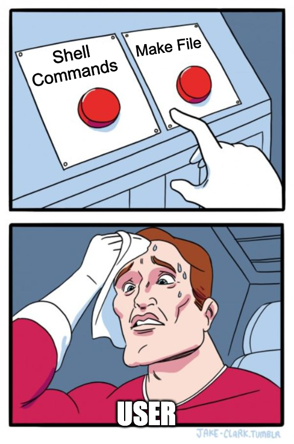

<h1 align="center">Movie Recommendation Challenge</h1>
<p align="center">
  
  
  <a href="https://www.linkedin.com/in/erickseo/">
  
  </a>
  <a href="https://github.com/seoerick">
  
  </a>
  <a href="mailto:erick.seo@picpay.com" alt="gmail" target="_blank">
  
  </a>
  </br>

  

</p>


## Usage



To download dataset and cleaning:

```
make cleaning_process
```

To training yout KNN dataset:

```
make training_process
```

To launch movie_recommender endpoint:

```
make build_endpoint
```

To build all:
```
make build
```

To execute unit_test:
```
make unit_test
```

## Endpoints


### List Movies
list movieId and Title available
```
curl --location --request GET 'http://0.0.0.0:5005/list_movie'
```

### Simmilar Movies
list the 10 most similar movies
```
curl --location --request GET 'http://0.0.0.0:5005/similar_movie?movieId=1'
```


## ToDo
- Swagger
- Code organization
- Optimize Cleaning process (memory) with tags
- levenshtein distance
- Add new ratings movies endpoint
- Airflow pipeline process
